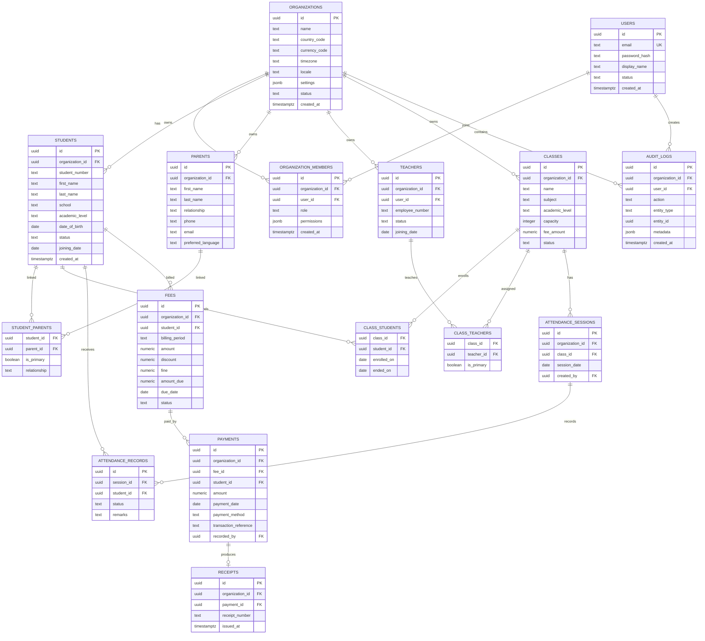

# Initial PostgreSQL ER Model

The schema is tenant-aware. Every organization-owned table carries `organization_id`; repositories and foreign keys must prevent cross-tenant references. UUIDs are used for public identifiers. Timestamps are stored in UTC.

## Required constraints and indexes

- `organization_members`: unique `(organization_id, user_id)`.
- `students`: unique `(organization_id, student_number)`.
- `student_parents`: primary key `(student_id, parent_id)`.
- `class_students`: primary key `(class_id, student_id)`.
- `class_teachers`: primary key `(class_id, teacher_id)`.
- `attendance_sessions`: unique `(organization_id, class_id, session_date)`.
- `attendance_records`: unique `(session_id, student_id)`.
- `fees`: unique `(organization_id, student_id, billing_period)`.
- `payments`: unique `(organization_id, transaction_reference)` when the reference is present.
- `receipts`: unique `(organization_id, receipt_number)` and unique `payment_id`.
- Check constraints enforce non-negative money, positive capacity, and valid status enums.
- Index all `organization_id` columns; add composite indexes for `(organization_id, status)`, `(organization_id, due_date)`, `(organization_id, payment_date)`, `(organization_id, session_date)`, and searchable student identifiers.

Foreign keys that connect two organization-owned records should be implemented with composite tenant-aware keys where practical, or validated in the service transaction before insertion.
